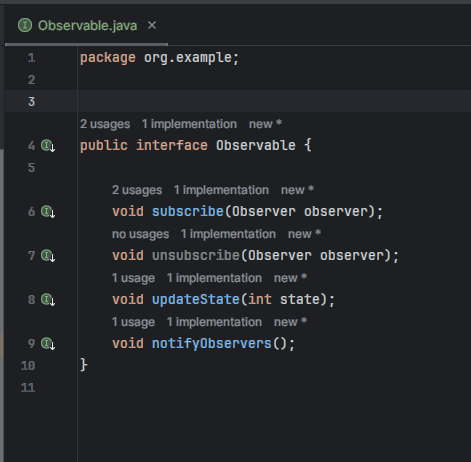
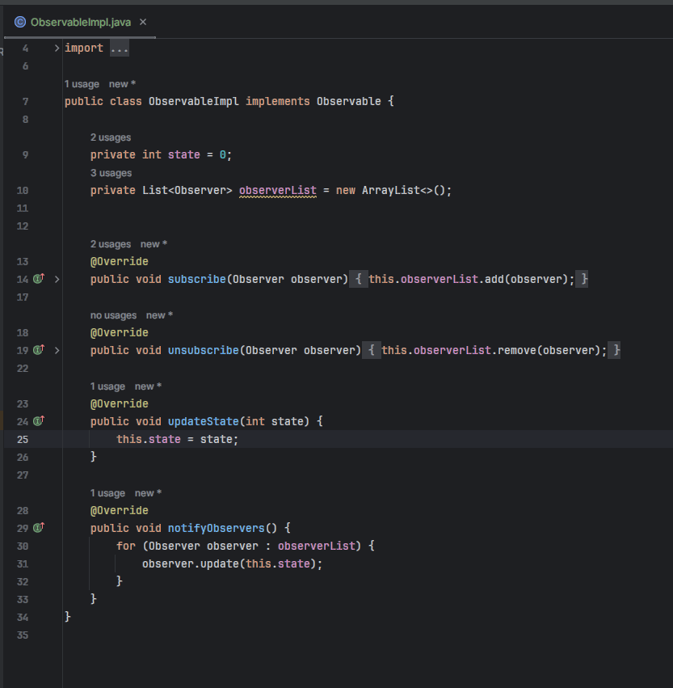
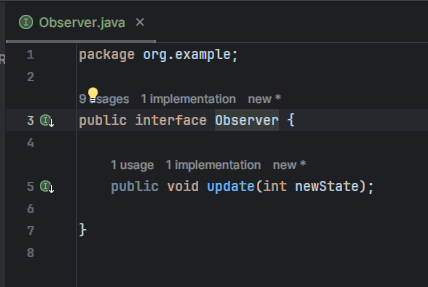
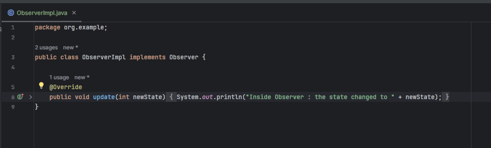
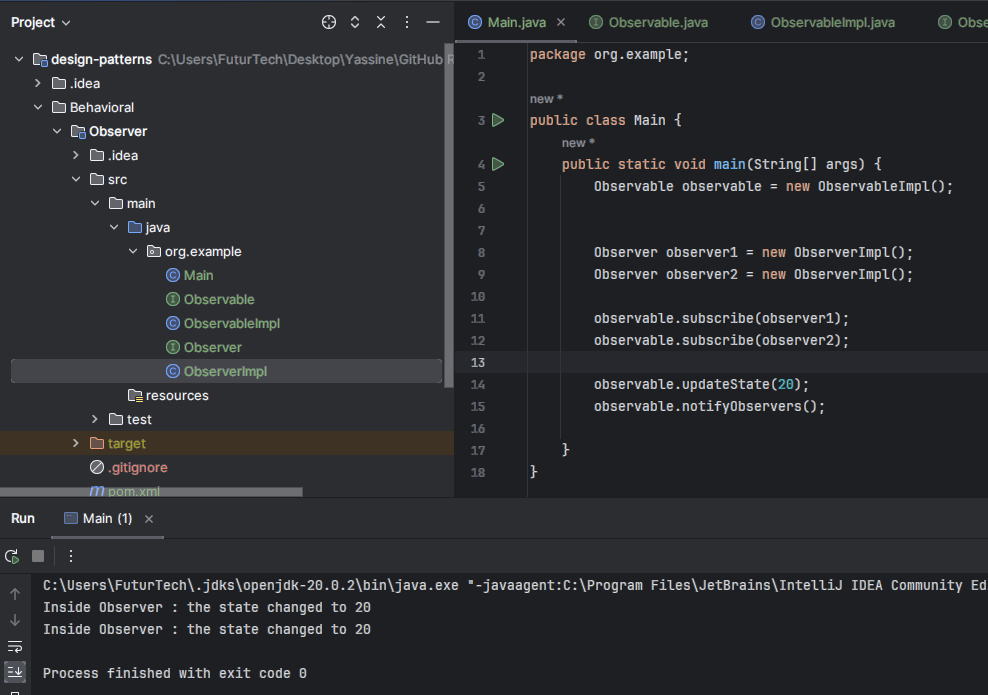

# Observer Pattern

- Création de l'interface Observable

- Création de l'implementation de l'interface Observable

- Création de l'interface Observer

- Création de l'implementation de l'interface Observer

- Test et éxecution

